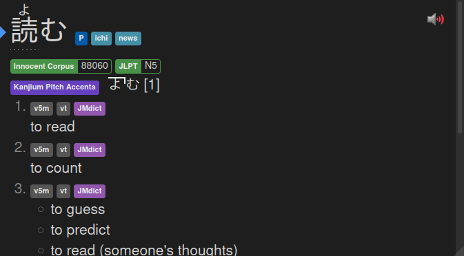

# yomichan-jlpt-vocab

This meta dictionary adds
[JLPT-level](https://www.jlpt.jp/e/about/levelsummary.html) tags to
words in [Yomichan](https://foosoft.net/projects/yomichan/).

## Attribution

JLPT data is sourced from [Jonathan
Waller‘s](http://www.tanos.co.uk/contact/) [JLPT
Resources](http://www.tanos.co.uk/jlpt/) page under the terms of the
Creative Commons BY license. This is the same resource used by
[jisho](https://jisho.org/), so the information found there should be
roughly equivalent.

Alternative headword forms (e.g., variations of あかい: 赤い, 紅い,
朱い, 緋い, 赭い, 丹い) are sourced from [The JMDict
Project](https://www.edrdg.org/jmdict/j_jmdict.html) under the terms
of the Creative Commons Attribution-ShareAlike License (V3.0).

## Install

Download **jlpt.zip** from the [latest
release](https://github.com/stephenmk/yomichan-jlpt-vocab/releases/latest)
and import it into Yomichan just like any other dictionary.

## Build from source (optional)

1. Clone this repository
2. Run the provided Python script within the project directory
    - This will produce a new directory named JLPT
3. Zip the contents of JLPT directory
    - Files must be in the top-level of the zip file, i.e., not
      within any sub-folders
4. Import the zip file into Yomichan

## Limitations

### Headwords

As mentioned above, a large number of alternative headwords have been
added to the base dataset provided by Jonathan Waller. This is useful
because, for example, the word 取り引き is included as an N1
vocabulary word in the original data, but other common forms of the
word (取引 and 取引き) are not.

The addition of these alternative forms means that some obscure
spellings that would never appear even on an N1 exam might be tagged
with an N5 label. For example, 歸る is tagged as N5 because it is an
alternative form of 帰る. **An asterisk has been added to the tags of
all alternative forms to allow the user to distinguish these usages.**

Some words have alternative forms that appear again on a
higher-difficulty list. For example, あさって is N5 but its kanji form
明後日 is N1. Words such as this have been assigned two tags, so
明後日 will appear as "N5*,N1".

### JLPT Lists

The JLPT is an evolving entity. As far as I know, no true
comprehensive vocabulary list is available to the public. The lists
provided by Jonathan Waller are already around 10 years old and may no
longer be as accurate as they once were. This dictionary is only
intended to be one useful resource among many in helping you learn
vocabulary.

## Similar Projects

Users on the [WaniKani
forums](https://community.wanikani.com/t/yomichan-and-wanikanijlpt-tags/37535)
have developed a similar solution using a custom-built version of
JMDict for Yomichan.

In contrast, the yomichan-jlpt-vocab project is a stand-alone meta
dictionary that can even be used without JMDict. This is useful for
people who only want to use monolingual dictionaries or who want to
[build their own
version](https://foosoft.net/projects/yomichan-import/) of JMDict for
Yomichan.
