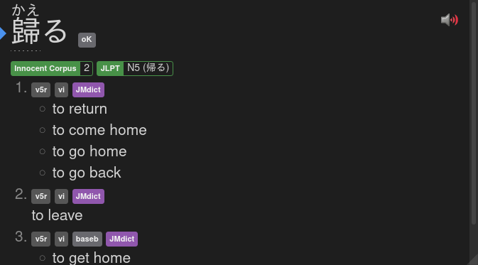
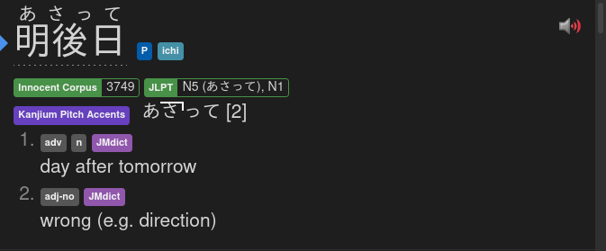

# yomichan-jlpt-vocab

This meta dictionary adds
[JLPT-level](https://www.jlpt.jp/e/about/levelsummary.html) tags to
words in [Yomichan](https://foosoft.net/projects/yomichan/).

## Attribution

JLPT data is sourced from [Jonathan
Waller‘s](http://www.tanos.co.uk/contact/) [JLPT
Resources](http://www.tanos.co.uk/jlpt/) page under the terms of the
Creative Commons BY license. This is the same resource used by
[jisho](https://jisho.org/), so the information found there should be
roughly equivalent.

Alternative headword forms (e.g., variations of あかい: 赤い, 紅い,
朱い, 緋い, 赭い, 丹い) are sourced from [The JMDict
Project](https://www.edrdg.org/jmdict/j_jmdict.html) under the terms
of the Creative Commons Attribution-ShareAlike License (V3.0).

## Install

Download **jlpt.zip** from the [latest
release](https://github.com/stephenmk/yomichan-jlpt-vocab/releases/latest)
and import it into Yomichan just like any other dictionary.

## Build from source (optional)

1. Clone this repository
2. Run the provided Python script within the project directory
    - This will produce a zip file named jlpt.zip
3. Import the zip file into Yomichan

## Limitations

### Headwords

As mentioned above, a large number of alternative headwords have been
added to the base dataset provided by Jonathan Waller. This is useful
because, for example, the word 取り引き is included as an N1
vocabulary word in the original data, but other common forms of the
word (取引 and 取引き) are not.

The addition of these alternative forms means that some obscure
spellings that would never appear on an exam might be tagged with an
N5 label. For example, 歸る is tagged as N5 because it is an
alternative form of 帰る. In these situations, the original spelling
is displayed in parentheses inside the tag.

Some words have alternative forms that appear again on a
higher-difficulty list. For example, あさって is N5 but its kanji form
明後日 is N1. Words such as this have been assigned two tags, so
明後日 will appear as "N5 (あさって), N1".

### JLPT Lists

The lists used in this project were compiled by Jonathan Waller around
10 years ago, and I have made no attempt to curate them further. I can
personally attest that more than one word from Waller's N1 list
appeared in vocabulary section of the N2 exam in December 2021. Even
though these lists shouldn't be considered comprehensive, I think they
are still useful for identifying words that you can expect to see on
the exam.

## Statistics

| | N5 | N4 | N3 | N2 | N1 | Total |
|-|-|-|-|-|-|-|
| Unique New Words | 667  | 630 | 1649 | 1731 | 3065 | 7742 |

Uniqueness is defined by a word's JMDict "seq" number, so 取り引き,
取引, and 取引き would be counted together as one unique word.
Unique words that appear in multiple lists are not counted multiple
times.

## Similar Projects

Users on the [WaniKani
forums](https://community.wanikani.com/t/yomichan-and-wanikanijlpt-tags/37535)
have developed a similar solution using a custom-built version of
JMDict for Yomichan.

In contrast, the yomichan-jlpt-vocab project is a stand-alone meta
dictionary that can even be used without JMDict. This is useful for
people who only want to use monolingual dictionaries or who want to
[build their own
version](https://foosoft.net/projects/yomichan-import/) of JMDict for
Yomichan.
